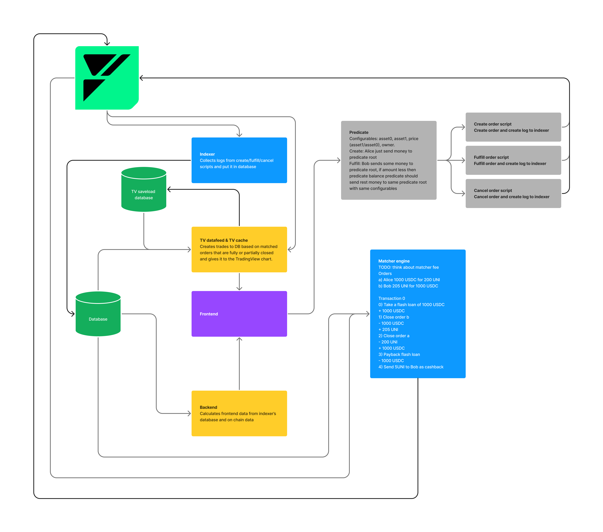

# 💫 Basics

<figure><figcaption></figcaption></figure>

Here are some of the more technical features of our MVP launch:

* Market Makers can earn rewards for active market-making (up to 3000 USDC each week)
* Our platform will only accept USDC as collateral but will offer a diverse range of popular markets such as ….
* We will rely on oracles (Pyth and Redstone) to track the prices of our contracts
* Profit, Liquidations, and Losses will be settled permissionless

We chose this approach out of an abundance of caution for MVP launch. As more tokens gain significant liquidity on Fuel Mainnet, we will also accept them as collateral. We are relying on two oracles and will utilize industry-best standards in Oracle pricing. Some of the measures that we take to ensure that a Mango-Markets style exploit is impossible to include:

**Multi-Oracle Systems**: mitigate risks stemming from any single oracle's potential failure or manipulation. ✅

**Time Delays:**  We use a time delay to prevent manipulation attacks and allow for time to check for extreme deviations/outliers.

For the MVP Launch, we will also include an **Internal Backup Database**

<figure><figcaption></figcaption></figure>
